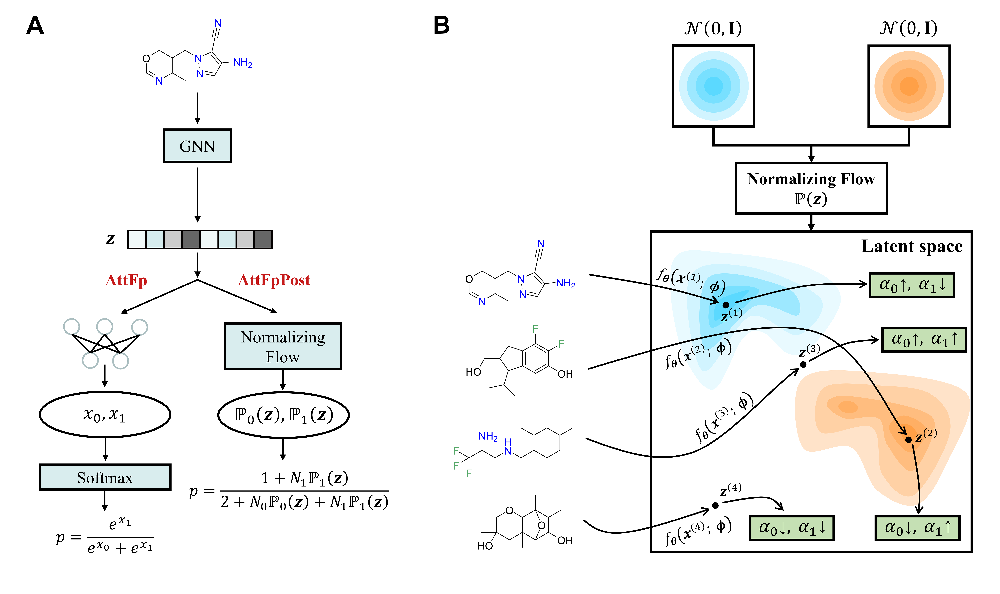

# Reducing Overconfident Errors in Molecular Property Classification using Posterior Network

This repository is the offical implementation of Reducing Overconfident Errors in Molecular Property Classification using Posterior Network.

<p align="center">
   
</p>

## Setup
```bash
conda create -n postnet python==3.9
conda activate postnet
conda install -c conda-forge rdkit
conda install pytorch==1.9.0 torchvision==0.10.0 torchaudio==0.9.0 cudatoolkit=11.1 -c pytorch -c conda-forge
conda install -c conda-forge tqdm
conda install -c conda-forge dgllife
conda install -c dglteam dgl-cuda11.1
pip install typed-argument-parser
conda install -c conda-forge mordred
pip install pyro-ppl
conda install -c conda-forge gpytorch
```

## Reproducing
You can reproduce the results presented in our paper quickly by running the corresponding Notebooks in the `notebooks` folder.
### Data
All the data used to generate the experimental results have been included in the `data` folder
## Trained model checkpoints
We provide the trained model checkpoints in the `trained_model` folder. You can find them there and easily use these checkpoints by running the `single_molecule_prediction.ipynb` Jupyter Notebook file.
### Supported Predictions
-   hERG:   Whether to inhibit hERG
-   BBB:    Whether it can cross the blood-brain barrier
-   CYP2C9: Whether to inhibit CYP2C9
-   CYP3A4: Whether to inhibit CYP3A4
-   Pgp-inhibitor:  Whether to inhibit P-gp
### Future Plans
-   Pgp-substrate:  Whether it is a P-gp substrate
### Usage
open `single_molecule_prediction.ipynb` 
```
smiles = 'CCCSC1=CC2=C(NC(NC(=O)OC)=N2)C=C1' # input your molecule
task_name = 'Pgp-inhibitor' # choose your prediction task

single_molecule_prediction(smiles, task_name)
```
